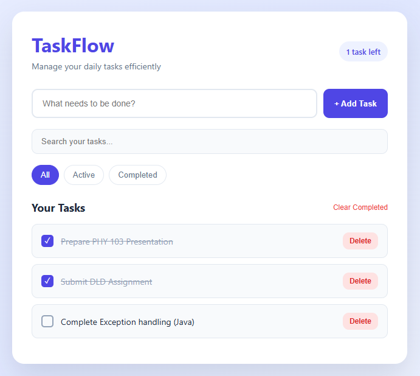

# ✅ TaskFlow — Task Management App

TaskFlow is a simple, responsive, and interactive task management web application built with HTML, CSS, and JavaScript. It helps users organize their daily tasks, track completed work, and stay productive.

## 📸 Screenshot



## ✨ Features

- ➕ Add new tasks
- ✅ Mark tasks as completed
- 🗑️ Delete tasks
- 🔍 Search tasks
- 📌 Filter tasks by All, Active, and Completed
- 🧹 Clear completed tasks
- 💾 Save tasks using LocalStorage
- 📊 Display remaining task count
- 🎨 Smooth animations and interactive UI
- 📱 Responsive design for different screen sizes

## 🛠️ Technologies Used

- HTML5
- CSS3
- JavaScript (ES6+)
- DOM Manipulation
- LocalStorage
- CSS Animations

## 📦 Dependencies

This project does not require any external libraries or npm packages.

It runs using vanilla HTML, CSS, and JavaScript.

## 📂 Project Structure

```text
TaskFlow/
│
├── index.html
├── style.css
├── script.js
├── Taskflow.png
└── README.md
